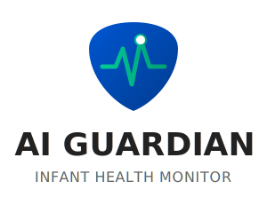

<p align="center">
  
</p>

<p align="center">A multi-modal AI system that analyzes video of infants to assess health status using four parallel pipelines and a clinical reasoning engine.</p>

Upload a short video of your baby and AI Guardian will extract vital signs from the video, classify audio (cry detection + respiratory sounds), assess skin condition, and generate a triage report with messages for both parents and healthcare providers.

Built for the [MedGemma Impact Challenge](https://www.kaggle.com/competitions/medgemma-impact-challenge) on Kaggle, hosted by Google Research. Uses three HAI-DEF models: **MedGemma 4B** (clinical reasoning), **MedGemma 1.5 4B** (skin classification), and **Google HeAR** (respiratory audio analysis). All processing runs locally on Apple Silicon — no data is sent to the cloud.

> **Disclaimer**: This is a research prototype and is NOT approved for clinical use. Always consult qualified healthcare professionals for medical decisions.

## How It Works

AI Guardian processes a 10-second video clip through four parallel AI pipelines:

| Pipeline | Input | What It Does | Model |
|----------|-------|-------------|-------|
| **rPPG** | Video frames (300 @ 30 FPS) | Extracts heart rate, respiratory rate, SpO2, and HRV from subtle skin color changes | open-rppg ME-chunk |
| **Cry** | Audio (16 kHz mono) | Classifies baby cry type: hungry, discomfort, belly pain, tired, burping, cold | AST + SVM |
| **HeAR** | Audio (16 kHz mono) | Detects respiratory abnormalities using Google's Health Acoustic Representations | Google HeAR (HAI-DEF) |
| **VGA** | 3+ screenshots | Skin condition classification (healthy / eczema / chickenpox) via MedGemma 1.5 4B | MedGemma 1.5 4B (HAI-DEF) |

Results from all pipelines are fused by a **MedGemma 4B** (HAI-DEF) clinical reasoning engine that generates:
- A **parent-friendly message** explaining findings in plain language
- A **clinical note** for healthcare providers with medical terminology
- A **triage priority** level (Critical / Urgent / Moderate / Low)

## Project Structure

```
ai-guardian/
├── src/
│   ├── backend/
│   │   └── api.py                  # FastAPI server (all endpoints)
│   ├── frontend/
│   │   └── src/
│   │       ├── App.tsx             # React app shell
│   │       ├── components/
│   │       │   └── VideoUploadView.tsx   # Main UI: upload, process, results
│   │       └── utils/
│   │           └── videoProcessor.ts     # Browser-side frame/audio extraction
│   ├── core/
│   │   ├── base_pipeline.py        # Pipeline interface (PipelineResult)
│   │   ├── config.py               # All pipeline configurations
│   │   └── fusion_engine.py        # MedGemma 4B clinical reasoning
│   ├── pipelines/
│   │   ├── rppg/pipeline.py        # Contactless vital signs (open-rppg)
│   │   ├── cry/pipeline.py         # Baby cry classification (AST + SVM)
│   │   ├── hear/pipeline.py        # Respiratory sounds (Google HeAR + MLP)
│   │   └── vga/
│   │       ├── pipeline_mlx.py     # Skin classifier — MLX / Apple Silicon
│   │       ├── pipeline.py         # Skin classifier — PyTorch / CUDA
│   │       ├── finetune_mlx.py     # LoRA fine-tuning (MLX)
│   │       ├── finetune.py         # QLoRA fine-tuning (PyTorch)
│   │       ├── inference_mlx.py    # Standalone eval (MLX)
│   │       ├── inference.py        # Standalone eval (PyTorch)
│   │       ├── scrape.py           # Google Images scraper (Selenium)
│   │       ├── deduplicate.py      # Perceptual hash deduplication
│   │       └── quality_filter.py   # Resolution & blur filter
│   └── utils/
│       └── preprocessing.py        # Audio/video/image preprocessing helpers
├── tests/                          # Pytest test suite
├── data/                           # Datasets (not in repo, see below)
├── models/                         # Trained classifiers (not in repo, see below)
├── requirements.txt                # Python dependencies
└── README.md
```

## Quick Start

### Prerequisites

- **Python 3.10+**
- **Node.js 18+** (for the frontend)
- **Apple Silicon Mac** required for MLX pipelines (MedGemma + VGA). NVIDIA GPU alternative for PyTorch/CUDA path.
- **16GB+ unified memory** recommended (8GB works but VGA must be disabled alongside FusionEngine)
- **Hugging Face account** with access to gated models (HeAR, MedGemma)

### 1. Clone and Set Up Python

```bash
git clone <repository-url>
cd ai-guardian

python -m venv venv
source venv/bin/activate
pip install -r requirements.txt
```

### 2. Configure Hugging Face Access

Several models require Hugging Face authentication:

```bash
# Install the CLI if needed
pip install huggingface-hub

# Login with your token
huggingface-cli login
```

Then request access to these gated models on huggingface.co:
- [google/hear-pytorch](https://huggingface.co/google/hear-pytorch) — respiratory audio analysis (HeAR)
- [mlx-community/medgemma-4b-it-4bit](https://huggingface.co/mlx-community/medgemma-4b-it-4bit) — clinical reasoning (FusionEngine)
- [mlx-community/medgemma-1.5-4b-it-4bit](https://huggingface.co/mlx-community/medgemma-1.5-4b-it-4bit) — skin classification (VGA)

### 3. Train Classifiers (First Time Only)

The Cry and HeAR pipelines need trained classifier models. Download datasets and train:

```bash
# Cry classifier: download Donate-a-Cry dataset, extract embeddings, train SVM
python -m src.pipelines.cry.download_donate_a_cry
python -m src.pipelines.cry.extract_embeddings
python -m src.pipelines.cry.train_classifier

# HeAR classifier: download SPRSound dataset, extract embeddings, train MLP
python -m src.pipelines.hear.download_sprsound
python -m src.pipelines.hear.extract_embeddings
python -m src.pipelines.hear.train_classifier
```

Trained models are saved to `models/cry_classifier/` and `models/sprsound_classifier/`.

### 4. Install and Start Frontend

```bash
cd src/frontend
npm install
npm run dev
```

The frontend runs at `http://localhost:5173`.

### 5. Start Backend

In a separate terminal (with the virtual environment activated):

```bash
python -m src.backend.api
```

The backend starts at `http://localhost:8000`. On first launch it downloads and loads all pipeline models (this takes 30-60 seconds).

### 6. Use It

1. Open `http://localhost:5173` in your browser
2. Upload a video of your baby (MP4, MOV, WebM, or AVI)
3. Optionally fill in patient info (age in months, sex, any concerns)
4. Click "Process Video"
5. Wait for extraction (~10s) and AI processing (~30-60s)
6. View your triage report with parent message and clinical note

## API Endpoints

| Method | Path | Description |
|--------|------|-------------|
| `GET` | `/health` | Health check |
| `GET` | `/ready` | Pipeline readiness status |
| `POST` | `/api/process-video` | Process uploaded video (main endpoint) |
| `POST` | `/api/process-frames` | Process batch of rPPG frames only |
| `WS` | `/ws/rppg` | Real-time WebSocket for live rPPG |

### POST /api/process-video

Request body (JSON):
```json
{
  "video_frames": ["base64_frame1", "..."],
  "audio_data": "base64_wav_16khz_mono",
  "screenshots": ["base64_img1", "..."],
  "metadata": { "fps": 30, "duration": 10 },
  "patient_age": 6,
  "patient_sex": "Female",
  "parent_notes": "Coughing since yesterday"
}
```

The frontend handles all frame/audio extraction automatically.

## Pipeline Details

### rPPG (Remote Photoplethysmography)

Uses the [open-rppg](https://github.com/nickklos10/open-rppg) library with the `ME-chunk.rlap` model to extract cardiac signals from facial skin color variations.

**Outputs**: Heart rate (BPM), respiratory rate (breaths/min), SpO2 estimate, HRV metrics (SDNN, RMSSD, LF/HF ratio), signal quality index.

### Cry Classification

Two-stage pipeline: first extracts 768-dimensional embeddings using an [Audio Spectrogram Transformer](https://huggingface.co/MIT/ast-finetuned-audioset-10-10-0.4593) (or HuBERT), then classifies with an SVM trained on the [Donate-a-Cry](https://github.com/gveres/donateacry-corpus) dataset.

**Labels**: belly pain, burping, cold, discomfort, hungry, tired.

### HeAR (Health Acoustic Representations)

Uses [Google's HeAR model](https://huggingface.co/google/hear-pytorch) (HAI-DEF) to extract 512-dimensional health-aware audio embeddings, then classifies with MLP classifiers trained on the [SPRSound](https://github.com/SJTU-YONGFU-RESEARCH-GRP/SPRSound) dataset.

**Outputs**: Binary classification (Normal vs Adventitious), multiclass classification (CAS/DAS/Normal/Poor quality).

**Audio quality handling**: HeAR was trained on stethoscope-recorded lung sounds, so phone/ambient audio is out-of-distribution. The pipeline includes a 3-layer quality gate:
1. If the multiclass classifier reports "Poor Quality", the binary prediction is overridden to "Inconclusive"
2. If binary confidence is below 75%, the prediction is reported as "Inconclusive"
3. The FusionEngine prompt includes a note that audio was captured via phone microphone and respiratory findings should be weighted accordingly

### VGA (Visual Grading Assessment)

Classifies infant skin conditions from video screenshots using [MedGemma 1.5 4B](https://huggingface.co/google/medgemma-1.5-4b-it) (HAI-DEF). Processes multiple screenshots and aggregates via majority vote.

**Labels**: healthy, eczema, chickenpox.

**Two backends** (auto-detected at startup):
- **Apple Silicon (MLX)**: Uses `mlx-vlm` with the 4-bit quantized model (`mlx-community/medgemma-1.5-4b-it-4bit`). Currently runs as zero-shot classifier (76.6% test accuracy). Requires ~2.5GB memory.
- **CUDA (PyTorch)**: Uses `transformers` + `peft` with a QLoRA fine-tuned adapter. Requires NVIDIA GPU with 4GB+ VRAM.

**Data pipeline** (scrape, deduplicate, filter, fine-tune):

```bash
# 1. Scrape images from Google Images
python -m src.pipelines.vga.scrape

# 2. Deduplicate with perceptual hashing
python -m src.pipelines.vga.deduplicate

# 3. Quality filter (resolution, blur, file size)
python -m src.pipelines.vga.quality_filter

# 4. Fine-tune LoRA adapter
# Apple Silicon:
python -m src.pipelines.vga.finetune_mlx
# CUDA:
python -m src.pipelines.vga.finetune

# 5. Evaluate
python -m src.pipelines.vga.inference_mlx --eval   # Apple Silicon
python -m src.pipelines.vga.inference --eval        # CUDA
```

### Fusion Engine (MedGemma 4B)

Combines all pipeline outputs with patient context (age, sex, parent observations) and uses [MedGemma 4B](https://huggingface.co/mlx-community/medgemma-4b-it-4bit) (HAI-DEF, quantized, running locally via MLX) to generate clinical interpretations.

Uses a **two-pass architecture**:
1. **Parent pass**: Generates priority level, critical alerts, and a plain-language parent message (max 120 words, no medical jargon)
2. **Specialist pass**: Generates a clinical note with medical terminology, differential considerations, and recommended follow-up

**Triage priority levels**:
- **CRITICAL** — Immediate medical attention required (call emergency services)
- **URGENT** — Seek medical attention within 1-2 hours
- **MODERATE** — Schedule appointment with healthcare provider
- **LOW** — Continue routine monitoring

## Configuration

All pipeline parameters are in [src/core/config.py](src/core/config.py):

- rPPG: model selection, FPS, filter bandpass, window size
- HeAR: sample rate, chunk duration, overlap, confidence threshold
- Cry: backend selection (AST vs HuBERT), embedding dimension
- VGA: base model, adapter path, labels, confidence threshold
- Fusion: pipeline weights, confidence thresholds, MedGemma toggle

## Development

```bash
# Run tests
pytest tests/

# Format code
black src/ tests/

# Lint
flake8 src/ tests/

# Build frontend for production
cd src/frontend && npm run build
```

## Tech Stack

**Backend**: Python 3.12, FastAPI, PyTorch, MLX, mlx-vlm, open-rppg, transformers, scikit-learn

**Frontend**: React 19, TypeScript, Vite

**HAI-DEF Models**: MedGemma 4B (clinical reasoning), MedGemma 1.5 4B (skin classification), Google HeAR (respiratory audio)

**Other Models**: Audio Spectrogram Transformer (cry embeddings), open-rppg ME-chunk (vital signs)

## License

Apache 2.0
