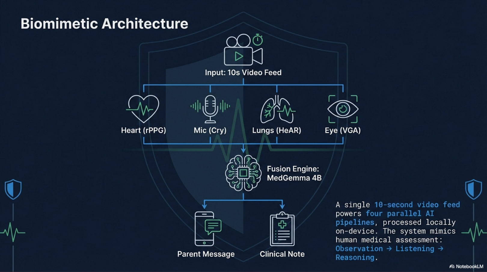

  

<h1 align="center">AI Guardian</h1>

<em>Infant Health Monitor</em>

## Your team

| Name              | Specialty                                       | Role                                          |
| ----------------- | ----------------------------------------------- | --------------------------------------------- |
| Sjors Vermijs     | Software Developer @ ANWB                       | General development, front-end, fine-tuning   |
| Dino Pasic        | Data Scientist @ University Maastricht          | General development, VGA pipelines            |
| William van Doorn | Clinical Chemist @ Academic Hospital Maastricht | General development, VGA MLX, audio pipelines |

## Problem statement

**Every year, 2.4 million infants die from preventable causes** (WHO, 2024). In the majority of cases, early detection and timely triage could have changed the outcome. Yet infant health assessment today depends almost entirely on access to a trained clinician — something unavailable at 2 AM in a family home, or at any hour in the 83 countries with fewer than 10 physicians per 10,000 people.

**The user and their journey**: A parent wakes at night to a crying, feverish baby with a rash. They face an impossible question: _is this an emergency, or can we wait until morning?_ Today, their options are a panicked Google search, chat with an (overconfident) LLM, or a costly ER visit. None provide multi-modal clinical assessment. With AI Guardian, they record 10 seconds of video. Within two minutes, they receive a personalized triage report — a plain-language message telling them whether to seek immediate care, and a clinical note they can share with their pediatrician.

**The unmet need**: No existing tool combines contactless vital signs, acoustic analysis, visual assessment, and clinical reasoning in a single consumer-accessible workflow. Telehealth requires synchronous clinician availability. Wearable monitors track single vital signs but lack interpretation. AI Guardian fills this gap by turning a smartphone camera into a multi-modal screening tool.

**Impact potential**: There are approximately 385 million children under age 5 globally, with 140 million births per year. Even conservative adoption in two target populations — (1) after-hours triage for parents in developed countries (~50M households with infants in the US/EU), and (2) first-line screening in low-resource settings (~90M annual births in LMICs) — could reduce unnecessary ER visits by an estimated 15-20% while accelerating care for genuinely critical cases. The dual-output design (parent message + clinical note) enables integration into existing healthcare workflows rather than replacing them.

## Overall solution

AI Guardian uses **three HAI-DEF models** in four complementary pipelines that leverage their unique medical training — capabilities that general-purpose models lack.

**1. Heart (rPPG) — Heart-rate monitoring** — extracts heart rate, respiratory rate, SpO2, and HRV from imperceptible skin color changes in video frames, providing contactless vital sign monitoring without any wearable. The pipeline uses the open-rPPG library (ME-chunk.rlap model) to recover a blood volume pulse (BVP) signal, which is bandpass-filtered (0.7–4.0 Hz, 3rd-order Butterworth) to isolate physiologically relevant frequencies. A signal quality index (SQI) drives confidence scoring: when lighting or motion degrades the signal (SQI < 0.3), the system warns that results may be unreliable rather than returning false readings.

**2. Cry — Baby cry classification.** The Cry pipeline analyzes audio from the uploaded video to classify the reason for a baby's cry. Audio is resampled to 16 kHz mono and passed through an Audio Spectrogram Transformer (AST) or HuBERT model to extract a 768-dimensional embedding. This embedding is then classified by a support vector machine (SVM) trained on the Donate-a-Cry dataset, predicting one of six cry types: belly pain, burping, cold, discomfort, hungry, or tired. The output includes the predicted cry type, class probabilities, and a confidence score.

**3. Lung (Google HeAR) — Respiratory sound analysis.** HeAR's health-specific audio embeddings capture clinically meaningful acoustic features that general audio models miss. We classify respiratory sounds as Normal, Adventitious (crackles/wheezes), or Poor Quality using MLP classifiers trained on the SPRSound dataset. Since HeAR was trained on stethoscope recordings and our input is phone audio, we implemented a quality gate: when the multiclass classifier detects poor audio quality or confidence is below 75%, the system reports "Inconclusive" rather than producing false alarms. This honest uncertainty is communicated to MedGemma, which adjusts its reasoning accordingly.

**4. Vision (MedGemma 1.5 4B) — Fine-tuned Skin condition classification.**
We fine-tuned MedGemma 1.5 4B with QLoRA (dinopasic/medgemma-skin-v2) on 452 Google Images of baby skin (healthy, eczema, chickenpox; 80/10/10 split). The resulting model achieves 95.7% test accuracy (F1 macro: 0.96), a major improvement over the 76.6% zero-shot baseline. Full training details and scripts are available in the repo, and the adapter is published at: https://huggingface.co/dinopasic/medgemma-skin-v2. New skin conditions can be added with minimal extra data and finetuning.

### Fusion Engine

**Clinical Reasoning (MedGemma 4B) — Guideline-grounded clinical reasoning engine.** MedGemma serves as the "fusion brain" that combines findings from all four pipelines in addition to patient context (age, sex, parent observations) that can be entered inside the app. A general-purpose LLM could summarize data, but MedGemma's medical pre-training enables it to _reason clinically_: cross-validating findings across modalities (e.g., elevated respiratory rate + adventitious sounds together warrant higher urgency than either alone), applying pediatric normal ranges, and generating differential considerations. Critically, MedGemma does not reason in a vacuum — we **augment** it with a **clinical guideline retrieval system** that injects age-appropriate, domain-relevant excerpts from three established protocols: **NICE NG143** (Fever in under 5s — traffic light system), **WHO IMCI** (Integrated Management of Childhood Illness — danger signs and pneumonia classification), and **PEWS** (Pediatric Early Warning Score). The retrieval system filters 17 guideline chunks by patient age and active clinical domains, scores them by threshold relevance to the patient's vital signs, and injects the top-4 into MedGemma's prompt with citation instructions. This grounds MedGemma's reasoning in evidence-based medicine rather than relying solely on its pre-training. We use a two-pass architecture — one pass for a plain-language parent message (no jargon), one for a clinical note with medical terminology and guideline citations — ensuring both audiences receive appropriate communication.

## Technical details

### Architecture and performance

A single 10-second video is processed by four pipelines running in parallel, with results fused by MedGemma into a triage report:

| Pipeline | Model              | Task                                | Performance                    | Memory  |
| -------- | ------------------ | ----------------------------------- | ------------------------------ | ------- |
| rPPG     | open-rppg ME-chunk | HR, RR, SpO2, HRV from video        | Signal quality-dependent       | <100 MB |
| Cry      | AST + SVM          | Cry type classification (6 classes) | Trained on Donate-a-Cry corpus | <100 MB |
| HeAR     | Google HeAR + MLP  | Respiratory sound screening         | Quality-gated for phone audio  | ~400 MB |
| VGA      | MedGemma 1.5 4B    | Skin classification (3 classes)     | 95.7% accuracy                 | ~2.5 GB |
| Fusion   | MedGemma 4B        | Clinical reasoning + triage         | Two-pass (parent + specialist) | ~2.5 GB |

**Deployment challenges and mitigations**:

- _Memory pressure_: 4-bit quantization for all LLMs; graceful pipeline disabling when memory is constrained
- _Phone audio domain gap_: 3-layer quality gate prevents false alarms from non-stethoscope audio
- _LLM output reliability_: Turn-boundary truncation and artifact sanitization ensure clean clinical output

### Practical deployment considerations

AI Guardian is designed as a **consumer-facing triage tool**, not a diagnostic device. Every report includes a disclaimer and recommends professional consultation. The triage levels (Critical / Urgent / Moderate / Low) are calibrated to err on the side of caution — the system is designed to reduce missed emergencies, not to replace clinical judgment. The dual-output format (parent + specialist) means the tool integrates naturally into the care pathway: a parent receives immediate guidance, and their clinician receives a structured pre-screening note at the next visit.
